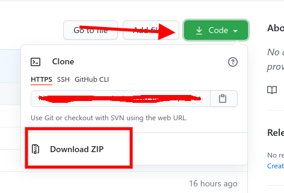
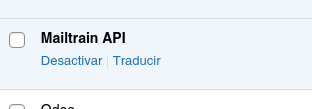
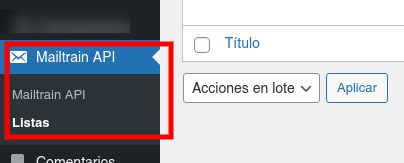
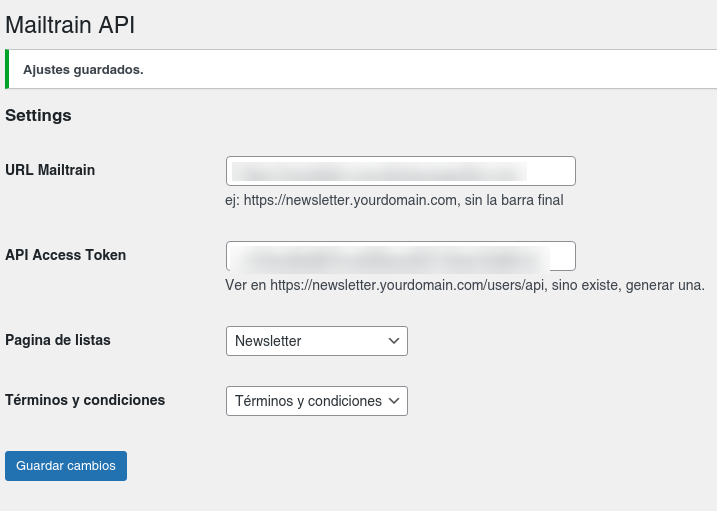
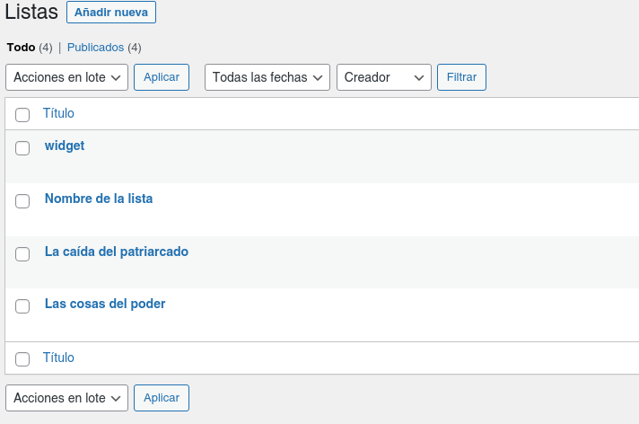
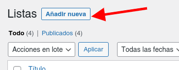
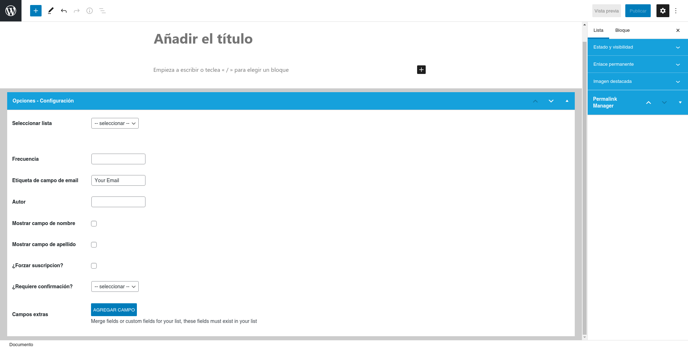
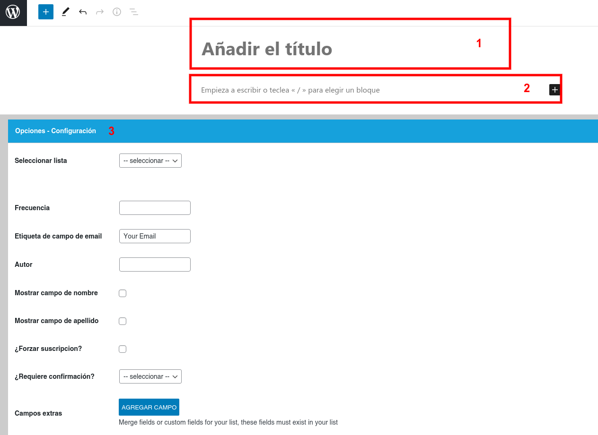
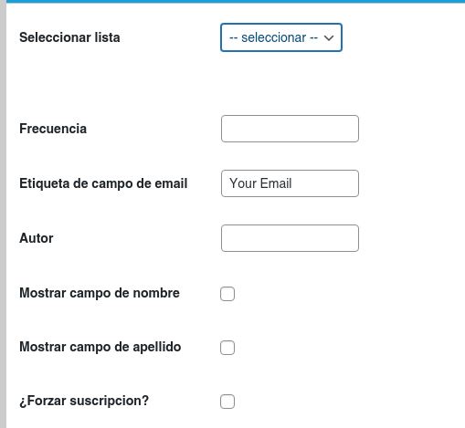

## WordPress Mailtrain Plugin

Este plugin fue desarrollado como parte de una estrategia **Open Source** para medios de todo el mundo basada en el CMS **WordPress**.  
Haciendo click en este [enlace](https://tiempoar.com.ar/proyecto-colaborativo/) se puede encontrar más información sobre el proyecto, así como las lista de plugins que complementan a este para tener un sitio completamente funcional.

### Introducción

El plugin de conexión entre Mailtrain y WordPress, se desarrollo para utilizarse con Mailtra, un sistema de envío de newsletter Open Source. Más información en los siguientes links:

[Mailtrain Web](https://mailtrain.org/)

[Mailtrain Wiki](https://github.com/Mailtrain-org/mailtrain/wiki)

### Instalación

Para instalar el plugin, debe clonar el siguiente repositorio [Github](https://bitbucket.org/genosha/ad-manager-plugin) o descargar el zip del mismo.

En el caso de haber descargado el zip, debe descomprimirlo dentro de **`wp-content/plugins`**.

Recuerde que una vez clonado se debe re-nombrar la carpeta a **mailtrain-api**, luego activar desde el menú principal de **Wordpress > Plugins**.

### Configuración

Una vez activado el plugin, se nos agrega un menú llamado **Mailtrain API**, donde se encuentran dos sub menús:

- **Mailtrain API** donde se encuentran las opciones.
- **Lists** donde se crean las listas donde los usuarios se suscribiran.

#### Configuración global

Cuando ingresamos al sub menú **Mailtrain API**, encontramos esta pantalla:

En esta pantalla se realiza la configuración básica del plugin, de la siguiente manera:

- **URL Mailtrain** es la url a la instalación de Mailtrain que se realizó previamente. `ej: https://newsletter.yourdomain.com, sin la barra final`
- **API Access Token** el token provisto por mailtrain para la conexión con su API. `Ver en https://newsletter.yourdomain.com/users/api, sino existe, generar una`.

Configurando estas dos opciones, ya tenemos acceso por API a la instalación de Mailtrain.

Las siguientes dos opciones, son las páginas por defecto que usa el plugin. Estas páginas se crean automáticamente al activar el plugin, cuando se desactiva, se borran de forma automática también.

- **Página de listas o Lists Pages** es la página principal para mostrar las listas a las que los usuarios pueden suscribirse.
- **Términos y condiciones o Terms and Conditions** es la referencia a la página de términos y condiciones del sitio. Esta página debe estar previamente creada manualmente.

#### Listas

El sub menú de Listas, contienen un `custom post type` donde podemos configurar las opciones para las suscripciones, creando uno por cada lista creada en Mailtrain previamente.

Con el botón de **Añadir nueva** podes crear una nueva Lista.

La pantalla principal para la creación es la siguiente:

El desglose de esta pantalla es:

- 1 **Título de la lista**
- 2 **Texto** si es necesarío, de la descripción de la lista.
- 3 **Opciones - Configuración** en esta parte configuramos por ejemplo, a que lista se suscribirian los usuarios.

El título y descripción de las listas, son los campos típicos de WordPress por lo cual no vamos a interiorizar en su uso.

Lo importante en esta parte es la parte de **Opciones - Configuración**, se configura de esta forma:

**Seleccionar Lista**: en este desplegable se selecciona la lista donde se recibiran los datos de los usuarios inscriptos. Este es la parte mas importante de la configuración.

**Frecuencia**: este campo es es `informativo` y muestra un texto (cadena) nada mas. No afecta la frecuencia de envíos realmente.

**Etiqueta de campo de email**: Este campo simplemente sirve para cambiar la etiqueta (label) del campo de email.

**Autor**: este campo es es `informativo` y muestra un texto (cadena) nada mas. El nombre del "autor" no se consulta de la API.

**Mostrar campo de nombre**: Mostrar o no el campo `Nombre` para el suscriptor. Este campo se puede ignorar por defecto, aunque en las listas creadas en Mailtrain este presente.

**Mostrar campo de apellido**: Mostrar o no el campo `Apellido` para el suscriptor. Este campo se puede ignorar por defecto, aunque en las listas creadas en Mailtrain este presente.

**¿Forzar suscripcion?**: Este opción se recomienda siempre tenerla activa ya que muchas veces Mailtrain falla al agregar los usuarios a las listas, sin avisarnos el por qué, de esta forma, se fuerza la creación del usuario en la lista, en caso de existir, el usuario se actualiza.

Los demas campos, si bien estan presentes, no tiene impacto sobre la configuración por el momento ya que son para extender funciones en caso de necesitarse.

## Diseño y templates

El plugin contiene un front que se puede modificar, este front, por defecto, se encuentra en la carpeta **`public/partials/pages`**. Se puede sobre escribir creando en nuestro theme principal (o child theme) una nueva carpeta llamada **mailtrain** y copiando dentro la carpeta **pages** del plugin con los archivos correspondientes, en este caso, el archivo **mailtrain.php**.

Este archivo contiene un loop de WordPress personalizado.

Los actions de este template se manejan mediante `ajax` desde el archivo `public/partials/js/front-ajax.js`.